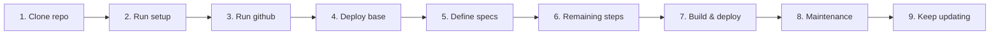

# Getting started

This repository is already seeded. It is the base you copy, not an empty
Keystone pack. The agent workflow (spec, plan, invariants, maintenance) is
the one used to build a Firebase product. The runtime is the part worth
keeping: Functions, Firestore, Auth, Storage, emulators, and a Next.js web shell.

The factory follows a simple 9-step lifecycle from fork to production maintenance:



---

## 1. Clone repo

Duplicate or fork this repo and point it at your git remote:

```bash
git clone <your-repo-url>
cd fire-factory
npm run install:all
```

(`npm run install:all` installs root workspaces and the standalone `frontend/` package.)

---

## 2. Run setup

Configure your Firebase project, display name, data center region, and local environments:

```bash
npm run set-project
```

- Prompts for your Firebase project ID, App Name, and Data Center Region.
- Automatically updates `.firebaserc`, `firebase.json` Firestore location, `package.json`, `agent/environment.yaml`, and code templates.
- Generates `frontend/.env.local` and `functions/.env` from examples.
- Provisions the existing Blaze project: registers a Web app, enables email/password sign-in, creates the default Firestore database and Storage bucket, and grants the GitHub deployer the roles a first Functions deploy needs. Web keys land in `frontend/.env.local`.
- At the end of the interactive prompt, offers to launch Step 3 (`setup-github`).

`gcloud` must be logged in as an owner of that project. The script starts `gcloud auth login` when it cannot see the project. Pass `--files-only` to rewrite files and skip every cloud call.

---

## 3. Run github

Set up automated GitHub Actions CI/CD and Firebase App Hosting deployments:

```bash
npm run setup-github
```

- Stamps the project id through the repo, then runs the same cloud provisioning as `set-project`.
- Generates `.github/workflows/ci.yaml`, `.github/workflows/deploy.yaml`, and `frontend/apphosting.yaml` (including the web API key and app id).
- Generates a standalone execution script `scripts/bootstrap/setup-deployments.sh`.
- Offers to execute the remaining steps:
  - Commits and pushes the repo to GitHub `main`.
  - Creates `github-deployer`, grants deploy roles, and sets the `FIREBASE_SERVICE_ACCOUNT` secret when `gh` is logged in.
  - Creates the App Hosting backend `web`. The Firebase CLI opens a browser once to authorize the GitHub repository.

---

## 4. Deploy base

Verify that the starter factory skeleton deploys cleanly to Firebase:

- **Automated (CI/CD):** Push to `main` triggers GitHub Actions to deploy Functions, Firestore rules, and Storage rules, while App Hosting deploys the web app.
- **Manual CLI:** Alternatively, deploy directly from your local terminal:
  ```bash
  npm run deploy:base
  ```
- **Verify production posture:** Confirm your deployed API is connected to live Firestore:
  ```bash
  npm run production-posture -- --api=https://<region>-<project>.cloudfunctions.net/api
  ```
  `/health` must report `"status": "ok"` and `"store": "firestore"`.

Grant yourself the first admin:
```bash
npm run create-admin -- --email=you@example.com --password='...'
```

---

## 5. Define specs

Stay in `agent/SPEC.md` §1.4 ("Product slot") until you would defend it.

Replace §1.4 with your product description:
- The problem and who it is for
- What v1 does
- What v1 does not do
- Nouns the system stores (domain entities)

Suggested prompt for your agent:

> Read `GETTING_STARTED.md` and `agent/SPEC.md`. I want to build: [product description].
> Update `agent/SPEC.md` §1.4 and any architecture sections the product forces you to change.
> Do not rewrite PLAN, INVARIANTS, or README yet.
> Do not add product routes or code. Summarize the spec when you are done.

---

## 6. Remaining steps generate

When you approve that spec, ask the agent to derive the build plan:

> The product spec in `agent/SPEC.md` §1.4 is approved. Append implementation steps to `agent/PLAN.md` (starting at step 02) and create the corresponding `agent/implementation/NN-*.md` notes. Keep steps in `⬜ Not started` status.

The agent derives steps strictly from approved §1.4. The agent must never mark a step `✅ Approved` without explicit human approval.

---

## 7. Finish work & deploy

Build out each step bottom-up:

1. Data definitions (rules, indexes, collection shapes).
2. Domain types (`types/domain.ts`).
3. Stores (`stores/`).
4. Provider adapters (`providers/`).
5. Controllers (`controllers/`).
6. Routes and web surfaces (`routes/`, `frontend/`).
7. Tests (`npm test`, `npm run lint`, `npm run typecheck`).
8. You review and mark the step `✅ Approved` in `agent/PLAN.md`.
9. Deploy: Push to `main` (or run `npm run deploy:functions` / `npm run deploy:rules`).

---

## 8. Enter maintenance

When all planned build steps are complete and the product is live:
1. Update `agent/PLAN.md`: change `Phase` from `🏗️ Build` to `🔧 Maintenance`.
2. See [agent/maintenance/README.md](./agent/maintenance/README.md). Do not keep extending `PLAN.md` for post-release tasks unless you open a new major version build.

---

## 9. Keep updating

Handle subsequent bug fixes, minor additions, and maintenance requests one at a time:
1. Copy `agent/maintenance/_TEMPLATE.md` to `agent/maintenance/YYYY-MM-DD_short-slug.md`.
2. If the change alters product meaning, update `agent/SPEC.md` first.
3. Implement the change and add tests (`npm test`).
4. Review, approve, and deploy.
