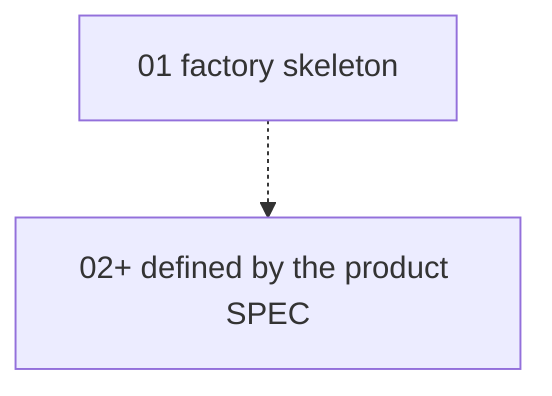

# PLAN.md

**Phase:** 🏗️ Build — factory skeleton is in place. A fork appends product
steps after the human approves `agent/SPEC.md` §1.4.

Do not add product steps in this repository while §1.4 is still the empty slot.
Do not mark a step `✅` without an explicit human approval.

## How to use

1. Find the first step with status `⬜` or `🔄`.
2. Read the SPEC sections the step names.
3. Read `agent/implementation/` for that step.
4. Implement bottom-up. Do not edit `INVARIANTS.md` on every save.
5. Run the step's tests.
6. The human marks the step `✅`.
7. On that approval, reconcile invariant claims for the step in one pass.
8. When the human says **maintenance**, follow [maintenance/README.md](./maintenance/README.md).

## Status

| Step | Name | Status | Spec |
|------|------|--------|------|
| 01 | [Project skeleton and local runtime](./implementation/01-project-skeleton.md) | ✅ Approved | §1–§12 |

Legend: `⬜` Not started · `🔄` In progress · `✅` Approved · `⛔` Blocked

## Step summaries

### 01 — Project skeleton and local runtime

Ship the Firebase runtime and the agent pack with no product domain: health,
session, staff grant, deny-by-default rules, emulator live tests, web shell,
and operator scripts. Later product milestones are added by the fork, from
the approved product SPEC, as steps 02 and on.

## Dependency graph

When steps 02+ exist, replace the dotted edge with the real graph.
